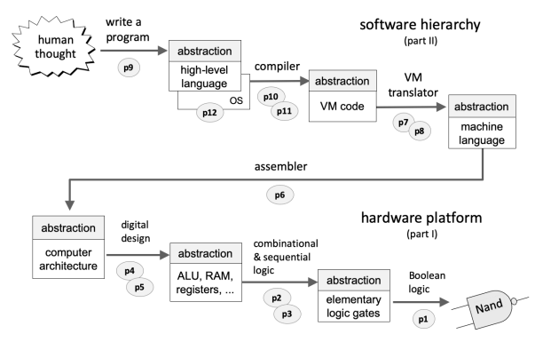

# Project Notes
> Each project I see to learn something and this would be were I'd store them. For this project (my first) specifically I store all project notes in their own folder, but I also want to store other things I've learned which is where this file comes in.

- Abstraction
    - It is the process of showing only what the function does, not how it's implemented
    - For example:
        1. If I implement an AND gate I would use two NAND gates then when we abstract it **you only would see the AND gate not the implementation underneath**  
        2. When a create a function that prints "yolololo" character by character then name it printYolololo() when we call it you don't see or program each individual character print functions
        
        3. In this image we see how when we implment an ALU we only see the lementary logic gates not the NAND gate, when we implement VM code we only see machine language not everything before that, and when we eventually get to where we create a program we don't see every logic gates we just see the high-level language.

- Notes taking
    1. Write down all of the ideas learned
        - What an idea is depends on the learner
        - For example, reading this *"Unlike the decimal system, which is founded on base 10, the binary system is founded on base 2" ([src](https://b1391bd6-da3d-477d-8c01-38cdf774495a.filesusr.com/ugd/44046b_f0eaab042ba042dcb58f3e08b46bb4d7.pdf))* I immediately pick up that **"binary system is founded on base 2 and decimal system is founded on base10"**
    2. Structure the content in a meaningful way
    3. Review & Revise 