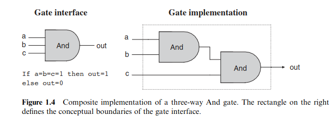

# Boolean Logic

> Boolean Algebra plays a significant role in hardware architecture

## Boolean Functions
>Functions can be represented with **truth tables** or **operations** (AND, OR, NOT) **over it's input variables** (A AND B) 

> All functions can be defined with at least one expression called the **cannonical representation**

- To get the **cannonical representation** we can..
    1. Take all of the true cases (those which output 1)
    2. Construct a term by AND-ing together literals
    3. Connect all terms with ORs
    - We can then simplify this representation with laws found in Boolean Algebra
- The number of Boolean functions which can be defined over n is 2^(2^n)
- Each boolean function has a conventional name which sees to define the the underlying operation

## Gates
> A gate is a physical device which implements a boolean function

> All logic gates have the same input and output semantics (1's and 0's)

> The simplest gates are made of transistors 
- Today most gates a implemented with **transistors** etched into silicon which are in turn called **chips**
- Because all gates have the same input and output semantics they can then be chained together. For example:

    - Figure 1.4 is an example of **logic design** or **gate logic**
    > **logic design** is the process of interconnecting gates in order to create more complex functions (**composite gates**)
 
    - The **gate interface** is *unique* and there is only one way to describe them.
        - Truth tables
        - Boolean expressions
        - Verbal Specification
    - The interface however can be implemented in multiple different ways

- Today hardware designers plan and optimize chips with **Hardware Description Languages** on their computers