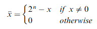

# Boolean Arithmetic
> Most operations performed by computers can be reduced down to *elementary addition of binary numbers*

> The ALU a core component of computers as it controls all things arithmetic and logic 

## Binary Numbers
- The binary system is founded on **base 2**
- To convert from any base to decimal (base 10) we can use:

    
    - Where *x* the number in *b* base
    - (10001)(base2) creates:
        - 1*(2^0) + 0*(2^1) + 0*(2^2) + 0*(2^3) + 1*(2^4) = 17(base10)
## Binary Addition
- A pair of binary numbers can be added digit by digit from right to left useing the same method as decimal numbers
    1. Add the right most digits (least significant bits)
    2. Add the carry bit to the next pair of bits up the significant bits ladder
    3. Repeat until we hit the left most digits (most significant bits)
    4. If the last bit creates a carry of 1 we can report an overflow else the addition was successful

    
- The logic gates for the addition of 2 binary numbers can also be used for the addition of 3 binary numbers (considering the carry bit)
## Signed Binary Numbers
- A binary system with n digits can generates 2^n different patterns
- If one were to represent signed numbers in binary it'd be best to split it into 2 equal parts, one for positive, and one for negative
- A solution for this is called **2's complement** or **radix complement**
- In a binary system with n digits, the 2’s complement of the number x is defined as follows:

- A binary system with n digits with 2's complement has the following properties:
    - There can be a total of 2^n signed numbers
        - The maximal number being 2^(n-1)
        - The minimal number being 2^n-1
    - All positive numbers start with 0
    - All negative numbers start with 1
    - To get from -x to x
        1. Flip all bits
        2. Add 1
- Adding two negative numbers is the same as adding two positive numbers
- Adding a positve and a negative number (subtracting) is simply done by adding the two