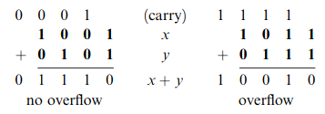
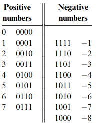
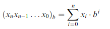

# Boolean Arithmetic
Purpose: Describe the ALU & Binary numbers

> Most operations performed by the computer is simply addition

- The **ALU** is the centerpiece chip that executes all the arithmetic and logical operations performed by the computer

- The binary system is founded on base 2 meaning 0's and 1's

- Binary addition is performed the same as decimal addition

- To represent negative or signed numbers in binary we split the digits into two equal subsets. This is known as 2's complement

- 2's complement has the following properties as show by the image below:
    - All positive numbers start with 0
    - All negative numbers start with 1
    - To get the negative number from the positive (and vice versa)
        1. Bitwise NOT all the bits
        2. Add 1

- In 2's complement the addition of negative numbers is the exact same as the addition of positive numbers
- In 2's complement the subtraction of numbers is simply the addition of positive and negative numbers

> In general, when converting from binary to decimal use the following formula:
> - let x be a string of digits, b be the base of x (2), and n the length of the string of digits
> - 